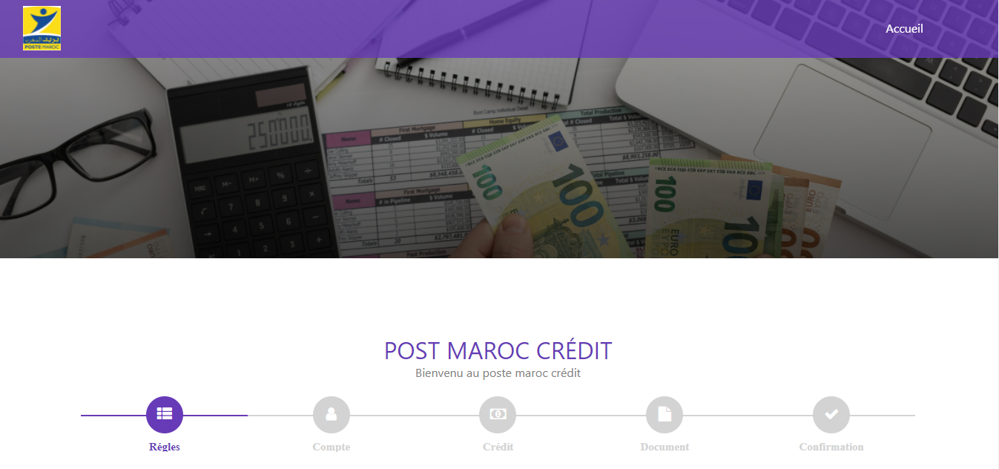
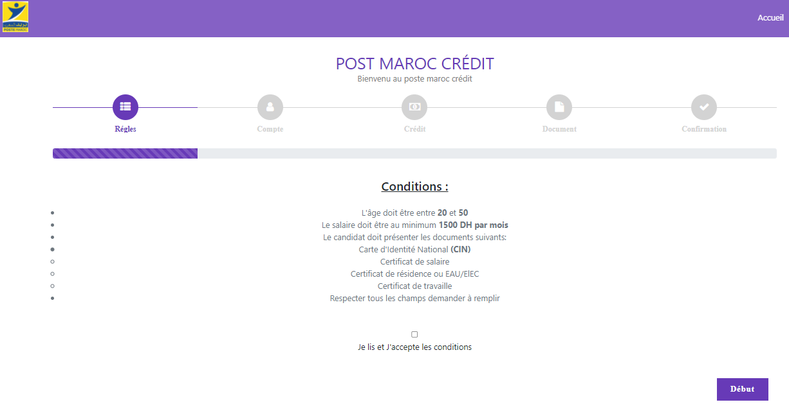
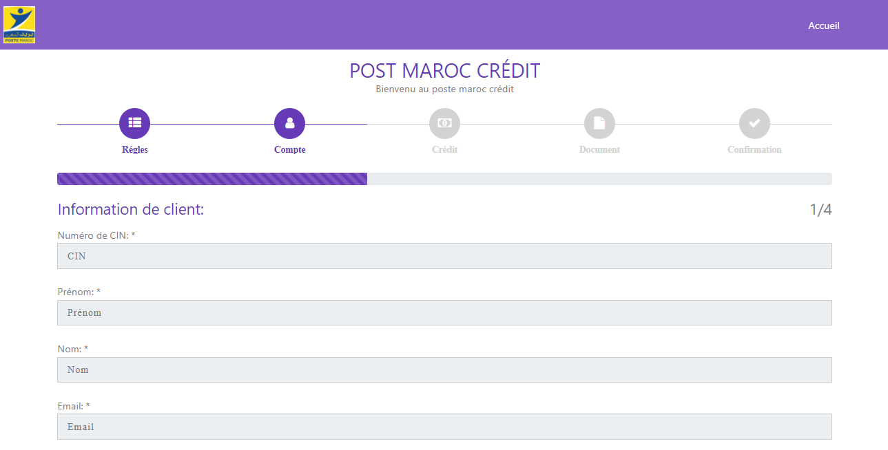
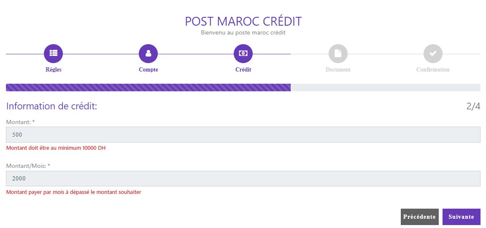
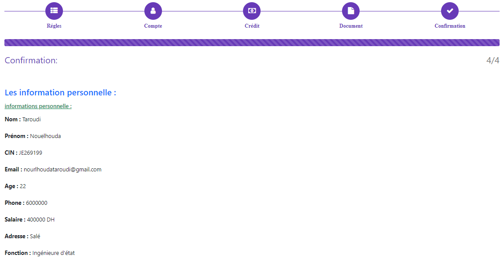
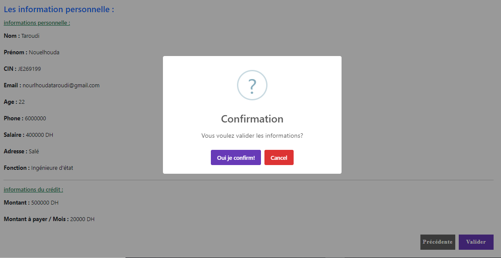
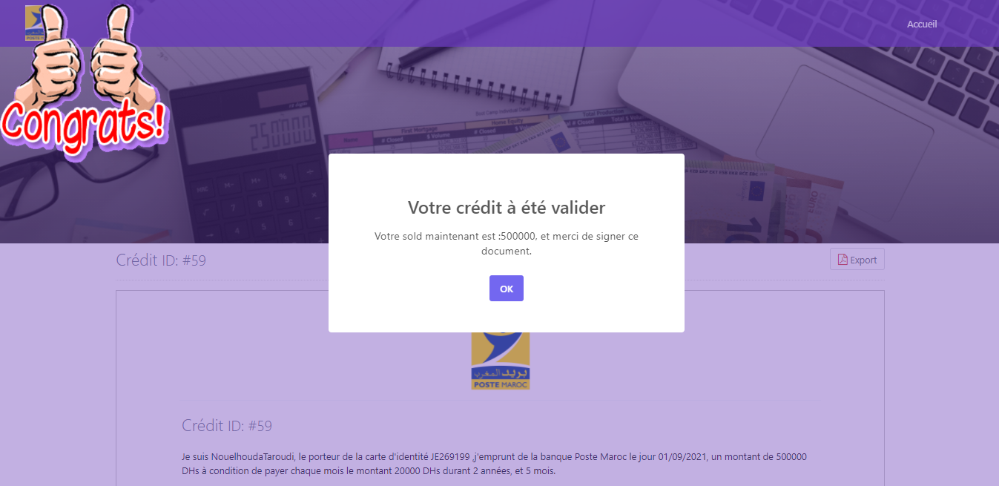
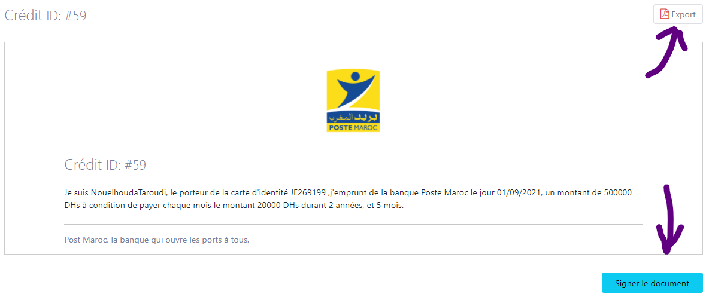
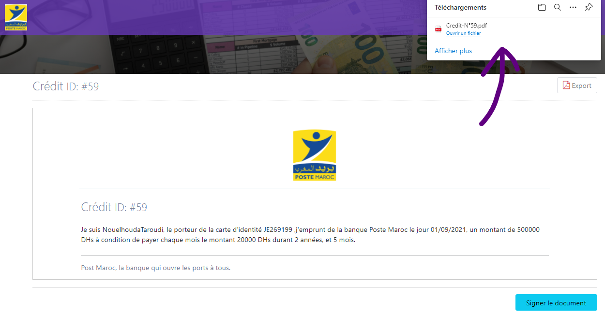

<h1 align="center">Post Maroc Crédit</h1>
<h3 align="center">Application web avec Angular & Laravel</h3></br>
<p align="center"></p>

#### Contenu
* [Introdution](#introduction)
* [Conditions](#conditions)
* [Usage](#usage)
* [Interfaces](#interfaces)

## Introduction
Aujourd’hui la plupart des gens préfère de faire un crédit par un site web sans aller au banque, pour gagner le temps, mais avec sécurité des informations. Le but est de réaliser une application responsive qui va rendre ce processus plus léger et facile aux clients, elle permet de :    
1. Traiter les informations du client.     
1. Vérifier les informations de client avec les conditions de banque.     
1. Traiter les documents par AI.     
1. Signer le contrat de credit.     
1. Ajouter le montant au solde de client. 

## Conditions 
- Angular >= 12
- PHP  >= 7.2.5
- Laravel >= 7.x

## Usage
### Usage est simple, via la commande :
  - Front end :
  ```GIT
  git clone https://github.com/nourelhouda-taroudi/Post-Maroc-Front.git
    
  ```
  - Back end :
  ```GIT
  git clone https://github.com/nourelhouda-taroudi/Post-Maroc-Api.git
    
  ```

## Interfaces : 
* ### Accueil
<p align="left">
  
</p>
<p align="left">
  
</p>

* ### Compte
<p align="left">
  
</p>

* ### Crédit
<p align="left">
  
</p>

* ### Document
<p align="left">
  
</p>

* ### Confirmation
<p align="left">
  
</p>
<p align="left">
  
</p>
<p align="left">
  
</p>

* ### Signature
<p align="left">
  
</p>
<p align="left">
  
</p>
